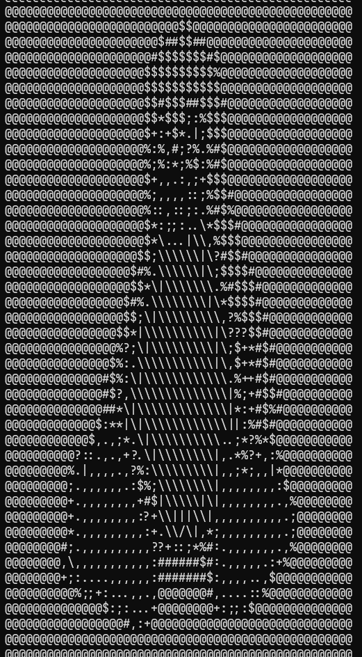

# Binary artist
#### The Binary artist is a simple tool to convert an image file to an ascii image.

# Build
* Install the rust lang (https://www.rust-lang.org/)
* Compile via ```cargo build```

# Usage

### Command
```binary-artist.exe --img <image path> <width> <height>```

### Example
```binary-artist.exe --img E:\binary-artist\assets\tux.png 50 50```

### Before


### After

